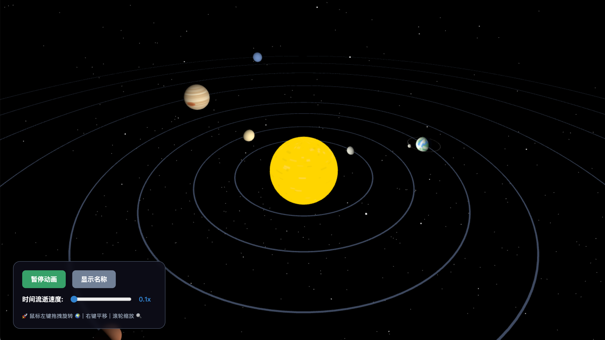

# 🌍 太阳系 3D 互动模拟器

一个使用 Three.js 构建的沉浸式太阳系 3D 互动演示页面，适合少儿科普教育。

## ✨ 功能特性

- 🪐 **八大行星展示**：水星、金星、地球、火星、木星、土星、天王星、海王星
- 🌙 **地球月球系统**：地球带有独立运行的月球
- 💍 **土星环效果**：逼真的土星环纹理
- ⏯️ **动画控制**：支持播放/暂停行星运行动画
- 📊 **速度调节**：可调节时间流逝速度（0.1x - 5x）
- 🏷️ **名称显示**：可切换显示/隐藏行星名称标签
- 🖱️ **交互操作**：
  - 鼠标左键拖拽：旋转视角
  - 鼠标右键拖拽：平移视角
  - 滚轮：缩放视图

## 🚀 快速开始

### 在线预览

直接在浏览器中打开 `sun.html` 文件即可运行：

```bash
# 使用默认浏览器打开
open sun.html
```

或使用本地服务器：

```bash
# Python 3
python -m http.server 8000

# Node.js
npx serve

# 访问 http://localhost:8000/sun.html
```

## 🛠️ 技术栈

- **Three.js** - 3D 渲染引擎（v0.160.0）
- **OrbitControls** - 视角控制
- **CSS2DRenderer** - 2D 标签渲染
- **Canvas API** - 纹理生成

## 📁 项目结构

```
Solar-System-Simulation/
├── sun.html      # 主页面（包含完整的 Three.js 代码）
├── earth.png     # 地球纹理参考图片
└── README.md     # 项目说明文档
```

## 🎮 使用说明

1. **打开页面**：在浏览器中加载 `sun.html`
2. **旋转视角**：按住鼠标左键拖拽
3. **平移视角**：按住鼠标右键拖拽
4. **缩放视图**：滚动鼠标滚轮
5. **控制动画**：
   - 点击「暂停动画」按钮暂停/播放
   - 拖动滑块调节动画速度
   - 点击「隐藏名称」切换标签显示

## 🌎 地球纹理



## 📝 开发说明

### 行星数据配置

行星参数定义在 `planetData` 数组中：

| 参数 | 说明 |
|------|------|
| `name` | 行星名称 |
| `baseColor` | 基础颜色 |
| `detailColor` | 细节颜色 |
| `radius` | 半径大小 |
| `distance` | 与太阳的距离 |
| `speed` | 公转速度 |
| `selfSpeed` | 自转速度 |
| `hasMoon` | 是否有月球（仅地球） |
| `hasRing` | 是否有星环（仅土星） |

### 光照系统

- **环境光**：模拟宇宙背景光
- **点光源**：模拟太阳光，产生昼夜交替效果

### 星空背景

生成 2000 颗随机分布的星星，营造深邃的宇宙氛围。

## 📄 许可证

MIT License
